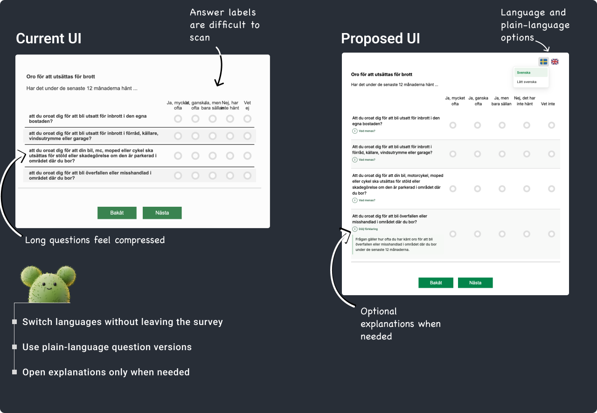

# Survey UI Improvement Demo

A React and TypeScript prototype exploring how an existing survey can be made clearer and more inclusive without changing its core layout or survey flow.

## Live demo

[Open the live demo](https://origo-demoapp.vercel.app/)

Use the **Improved UI** toggle below the survey card to compare the current and proposed interfaces.

## Goal

Improve the survey’s readability, accessibility, and ease of use while keeping its familiar structure and navigation.

## Current and proposed UI



## Key improvements

* Improved typography, spacing, and visual hierarchy to make questions and answer choices easier to read.

* Language switching at any point without losing previously selected answers. This helps users stay focused instead of leaving the survey to translate unfamiliar words.

* Plain-language versions in Swedish and English:

  * Lätt svenska
  * Easy English

  These versions use clearer wording to help non-native speakers and anyone who may find the original questions difficult to understand. Support for additional languages can be added later.

* Optional explanations for individual questions. These provide additional context about a question’s meaning and scope without making the main question longer.

* Accessible radio groups with associated labels and keyboard support.

## Built with

* React
* TypeScript
* Vite
* Vitest and React Testing Library

## Run locally

```bash
npm install
npm run dev
```
